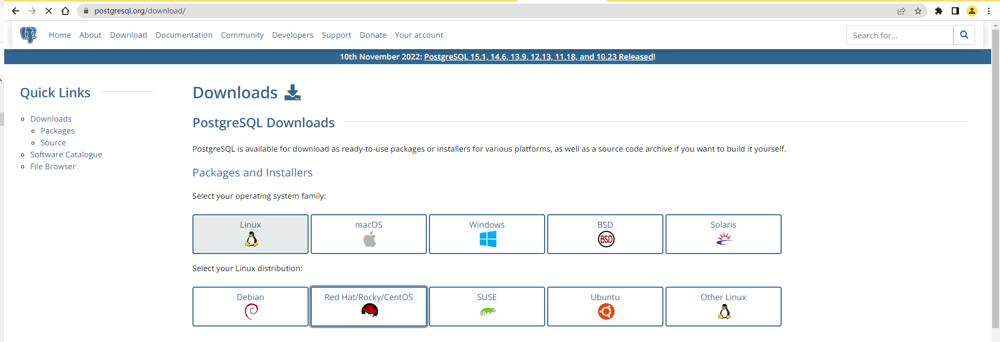
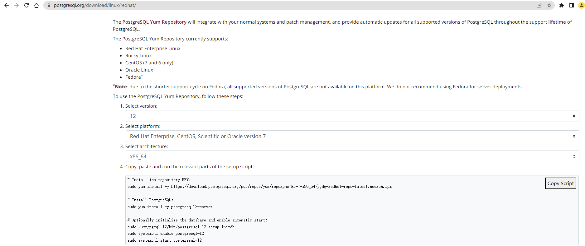
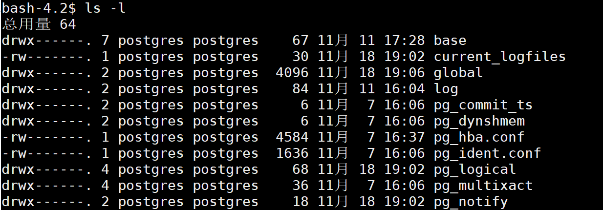
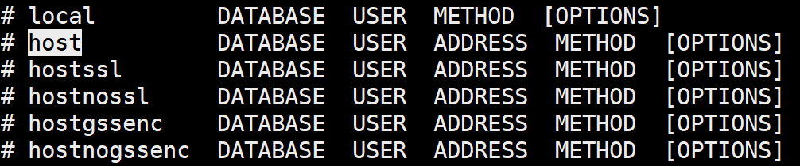
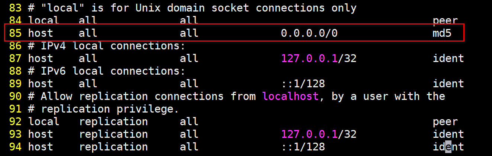
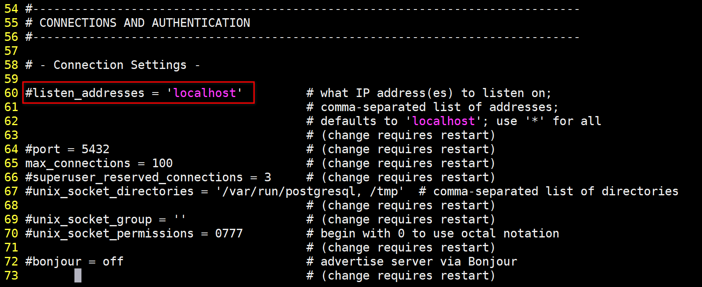
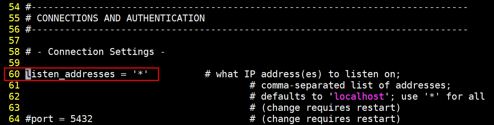
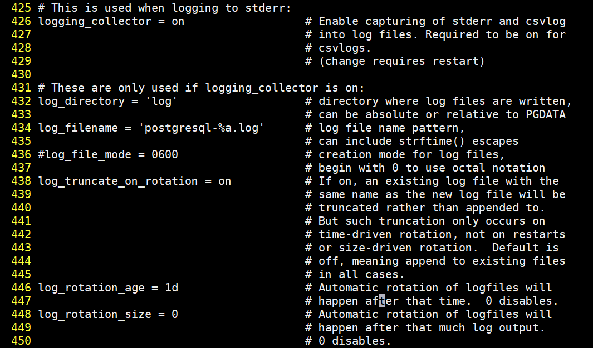

# PostgreSQL_Learning

## 一、PostgreSQL介绍

PostgreSQL是一个功能强大的 **开源** 的关系型数据库，底层基于C实现。

PostgreSQL的开源协议和Linux内核版本的开源协议是一样的。也就是BSD协议，这个协议基本和MIT开源协议一样，就是你可以对PostgreSQL进行一些封装，然后商业化来收费。

PostgreSQL的名字咋来的：之前叫Ingres，后面为了解决一些Ingres中的一些问题，作为后面的Ingres，就起名叫Postgre。

PostgreSQL版本迭代的速度比较快，现在最新的正式的发布版本，已经到了15.RELEASE。

PostgreSQL的版本选择一般有两种：

* 如果为了稳定的运行，推荐使用12.x版本。
* 如果想体验新特性，推荐使用14.x版本。

PostgreSQL允许跨版本升级，而且没有什么大问题。

PostgreSQL社区特别活跃，基本是三个月一发版，也就意味着很多常见的BUG都可以得到及时的修复。

PostgreSQL其实在国外使用的比较多，国内暂时还是以MySQL为主。

但是国内很多国产数据库都是基于PostgreSQL做的二次封装：比如华为GaussDB，还有腾讯的Tbase等。

甚至很多公司原来玩的Oracle，直接平转到PostgreSQL，同时国内的很多云厂商都支持PostgreSQL了。

PostgreSQL因为开源，所以有很多做数据迁移的工具，可以快速的从MySQL，SQLServer，Oracle直接平转到PostgreSQL，比如pgloader这样的数据迁移工具。

PostgreSQL的官方社区地址：https://www.postgresql.org/

PostgreSQL的国内社区地址：http://www.postgres.cn/v2/home

## 二、PostgreSQL和MySQL的区别

技术没有好坏之分，主要看一下是否符合业务的需要，能否解决业务需求；其次也要看社区的活跃度以及更新的频次。

MySQL不支持的几点内容：

* MySQL的数据类型不够丰富；
* MySQL不支持序列概念（Sequence）；
* 使用MySQL时，网上比较好用的插件；
* MySQL的性能优化监控工具不是很多，定位问题的成本是比较高；
* MySQL的主从复制没有一个官方的同步策略，同步问题难以解决；
* MySQL虽然开源但不够彻底。

PostgreSQL相对MySQL上述问题的特点：

* PostgreSQL的数据类型嘎嘎丰富；
* PostgreSQL是有序列的概念的；
* PostgreSQL的插件特别丰富；
* PostgreSQL支持主从复制的同步操作，可以实现数据的零丢失；
* PostgreSQL的MVCC实现和MySQL不大一样（PostgreSQL一行数据会存储多个版本，最多可以存储40亿个事务版本）。

## 三、PostgreSQL的安装

主要在Linux中安装，不推荐在Windows下安装。

Linux的版本尽量使用CentOS 7.x版本，最好是7.6或者是7.8版本。

去官网找安装的方式：



选择好PostgreSQL的版本，以及Linux的发行版本



拿到命令直接在Linux中运行即可

```sh
# 下载PGSQL的rpm包
sudo yum install -y https://download.postgresql.org/pub/repos/yum/reporpms/EL-7-x86_64/pgdg-redhat-repo-latest.noarch.rpm
# 安装PGSQL12的软件程序，需要下载，需要等一会，一般不会失败，即便失败，他也会重新帮你找镜像
sudo yum install -y postgresql12-server
# 数据库初始化
sudo /usr/pgsql-12/bin/postgresql-12-setup initdb
# 设置开启启动项，并设置为开启自行启动
sudo systemctl enable postgresql-12
# 启动PGSQL
sudo systemctl start postgresql-12
```
这种属于Windows下的傻瓜式安装，基本不会出错。

如果出错，可能是如下的问题：

* 安装Linux的时候，一定要选择最小安装；
* Linux不能连接外网；
* Linux中的5432端口可能被占用。

PostgreSQL不推荐使用root管理，在安装成功postgreSQL后，他默认会给你创建一个用户：postgres

使用PostgreSQL前需要先切换到postgres

```
su postgres
```

切换到postgres用户后，直接输入psql即可进入到postgreSQL提供的客户端

```
# 进入命令行
psql
# 查看有哪些库，如果是新安装的，有三个库：postgres，template0，template1
```

Windows版本的下载地址：https://sbp.enterprisedb.com/getfile.jsp?fileid=1258242

## 四、PostgreSQL的配置

两个配置文件：

* PostgreSQL的远程连接配置；
* PostgreSQL的日志配置。

PostgreSQL的主要配置放在数据目录下的， **postgresql.conf** 以及 **pg_hba.conf** 配置文件

```sh
# 配置文件目录
ls -l /var/lib/pgsql/12/data
```



上图可以看到，PostgreSQL的核心文件，都属于postgres用户，操作的时候，别用root用户，容易出问题，先切换到postgres用户再操作。

### 远程连接配置

PostgreSQL默认情况下不支持远程连接的，这个跟MySQL一样。

* MySQL给mysql.user追加用户，一般是采用grant的命令添加；
* PostgreSQL要基于配置文件修改，才能制定用户是否可以远程连接。

修改pg_hba.conf配置文件

用户以及对应数据库和连接方式的编写模板：



```
# 第一块
local：代表本地连接，host代表可以指定连接的ADDRESS
# 第二块
database编写数据库名，如果写all，代表所有库都可以连接
# 第三块
user编写连接的用户，可以写all，代表所有用户
# 第四块
address代表那些IP地址可以连接
# 第五块
method加密方式，这块不用过多关注，使用md5即可
# 示例配置：允许任意地址的全部用户连接所有数据库
host    all             all             0.0.0.0/0               md5
```



为了实现远程连接，除了用户级别的这种配置，还要针对服务级别修改一个配置

服务级别的配置在postgresql.conf



发现默认情况下，PostgreSQL只允许localhost连接，直接配置为*即可解决问题



为了生效，需要重启服务：

```sh
# 使用root用户重启
sudo systemctl restart postgresql-12
```

### 数据库的日志配置

查看postgresql.conf文件



PostgreSQL默认情况下，只保存7天的日志，循环覆盖。

```
# 代表日志是开启的。
logging_collector = on
# 日志存放的路径，默认放到当前目录下的log里
log_directory = 'log'
# 日志的文件名，默认是postgresql为前缀，星期作为后缀
log_filename = 'postgresql-%a.log'
# 默认一周过后，日志文件会被覆盖
log_truncate_on_rotation = on
# 一天一个日志文件
log_rotation_age = 1d
# 一个日志文件，没有大小限制
log_rotation_size = 0
```

