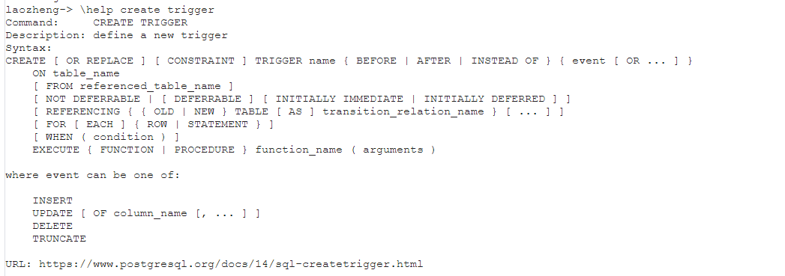
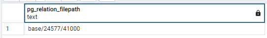
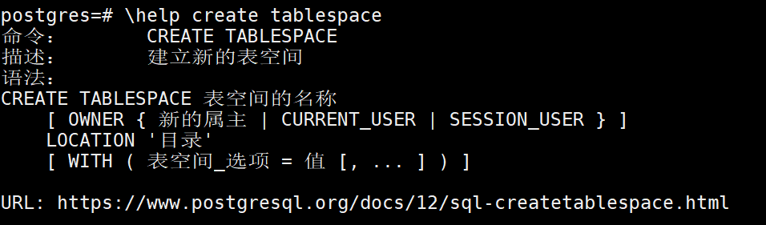
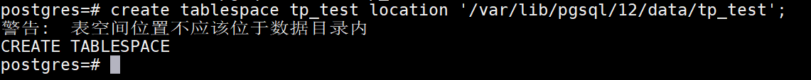
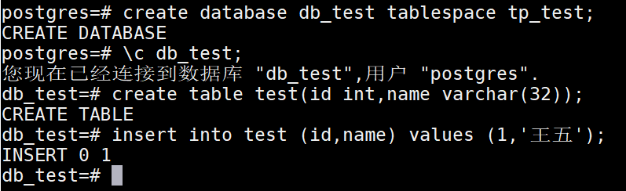
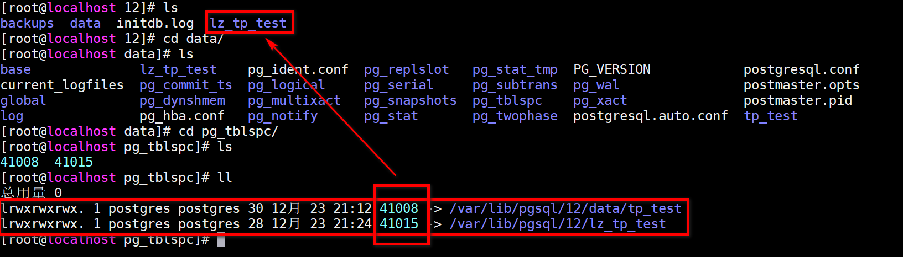
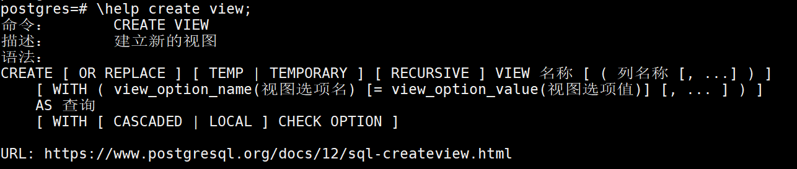
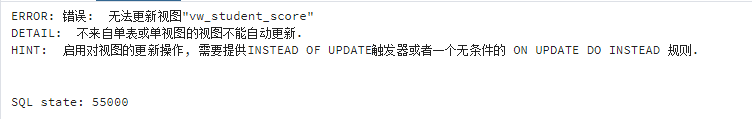
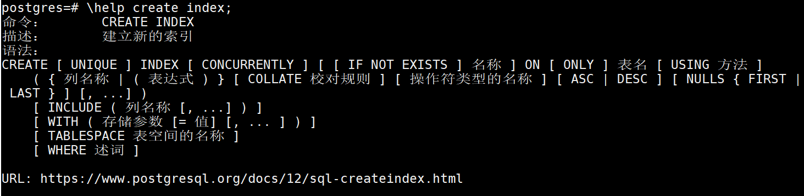
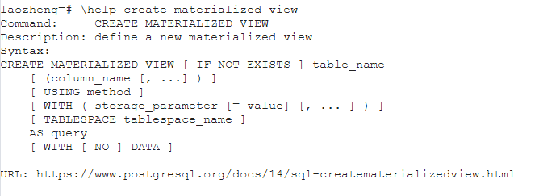

# PostgreSQL_Learning

## 一、PostgreSQL介绍

PostgreSQL是一个功能强大的 **开源** 的关系型数据库，底层基于C实现。

PostgreSQL的开源协议和Linux内核版本的开源协议是一样的。也就是BSD协议，这个协议基本和MIT开源协议一样，就是你可以对PostgreSQL进行一些封装，然后商业化来收费。

PostgreSQL的名字咋来的：之前叫Ingres，后面为了解决一些Ingres中的一些问题，作为后面的Ingres，就起名叫Postgre。

PostgreSQL版本迭代的速度比较快，现在最新的正式的发布版本，已经到了15.RELEASE。

PostgreSQL的版本选择一般有两种：

* 如果为了稳定的运行，推荐使用12.x版本。
* 如果想体验新特性，推荐使用14.x版本。

PostgreSQL允许跨版本升级，而且没有什么大问题。

PostgreSQL社区特别活跃，基本是三个月一发版，也就意味着很多常见的BUG都可以得到及时的修复。

PostgreSQL其实在国外使用的比较多，国内暂时还是以MySQL为主。

但是国内很多国产数据库都是基于PostgreSQL做的二次封装：比如华为GaussDB，还有腾讯的Tbase等。

甚至很多公司原来玩的Oracle，直接平转到PostgreSQL，同时国内的很多云厂商都支持PostgreSQL了。

PostgreSQL因为开源，所以有很多做数据迁移的工具，可以快速的从MySQL，SQLServer，Oracle直接平转到PostgreSQL，比如pgloader这样的数据迁移工具。

PostgreSQL的官方社区地址：https://www.postgresql.org/

PostgreSQL的国内社区地址：http://www.postgres.cn/v2/home

## 二、PostgreSQL和MySQL的区别

技术没有好坏之分，主要看一下是否符合业务的需要，能否解决业务需求；其次也要看社区的活跃度以及更新的频次。

MySQL不支持的几点内容：

* MySQL的数据类型不够丰富；
* MySQL不支持序列概念（Sequence）；
* 使用MySQL时，网上比较好用的插件；
* MySQL的性能优化监控工具不是很多，定位问题的成本是比较高；
* MySQL的主从复制没有一个官方的同步策略，同步问题难以解决；
* MySQL虽然开源但不够彻底。

PostgreSQL相对MySQL上述问题的特点：

* PostgreSQL的数据类型嘎嘎丰富；
* PostgreSQL是有序列的概念的；
* PostgreSQL的插件特别丰富；
* PostgreSQL支持主从复制的同步操作，可以实现数据的零丢失；
* PostgreSQL的MVCC实现和MySQL不大一样（PostgreSQL一行数据会存储多个版本，最多可以存储40亿个事务版本）。

## 三、PostgreSQL的安装

主要在Linux中安装，不推荐在Windows下安装。

Linux的版本尽量使用CentOS 7.x版本，最好是7.6或者是7.8版本。

去官网找安装的方式：


选择好PostgreSQL的版本，以及Linux的发行版本


拿到命令直接在Linux中运行即可

```sh
# 下载PGSQL的rpm包
sudo yum install -y https://download.postgresql.org/pub/repos/yum/reporpms/EL-7-x86_64/pgdg-redhat-repo-latest.noarch.rpm
# 安装PGSQL12的软件程序，需要下载，需要等一会，一般不会失败，即便失败，他也会重新帮你找镜像
sudo yum install -y postgresql12-server
# 数据库初始化
sudo /usr/pgsql-12/bin/postgresql-12-setup initdb
# 设置开启启动项，并设置为开启自行启动
sudo systemctl enable postgresql-12
# 启动PGSQL
sudo systemctl start postgresql-12
```
这种属于Windows下的傻瓜式安装，基本不会出错。

如果出错，可能是如下的问题：

* 安装Linux的时候，一定要选择最小安装；
* Linux不能连接外网；
* Linux中的5432端口可能被占用。

PostgreSQL不推荐使用root管理，在安装成功postgreSQL后，他默认会给你创建一个用户：postgres

使用PostgreSQL前需要先切换到postgres

```
su postgres
```

切换到postgres用户后，直接输入psql即可进入到postgreSQL提供的客户端

```
# 进入命令行
psql
# 查看有哪些库，如果是新安装的，有三个库：postgres，template0，template1
```

Windows版本的下载地址：https://sbp.enterprisedb.com/getfile.jsp?fileid=1258242

## 四、PostgreSQL的配置

两个配置文件：

* PostgreSQL的远程连接配置；
* PostgreSQL的日志配置。

PostgreSQL的主要配置放在数据目录下的， **postgresql.conf** 以及 **pg_hba.conf** 配置文件

```sh
# 配置文件目录
ls -l /var/lib/pgsql/12/data
```


上图可以看到，PostgreSQL的核心文件，都属于postgres用户，操作的时候，别用root用户，容易出问题，先切换到postgres用户再操作。

### 远程连接配置

PostgreSQL默认情况下不支持远程连接的，这个跟MySQL一样。

* MySQL给mysql.user追加用户，一般是采用grant的命令添加；
* PostgreSQL要基于配置文件修改，才能制定用户是否可以远程连接。

修改pg_hba.conf配置文件

用户以及对应数据库和连接方式的编写模板：


```
# 第一块
local：代表本地连接，host代表可以指定连接的ADDRESS
# 第二块
database编写数据库名，如果写all，代表所有库都可以连接
# 第三块
user编写连接的用户，可以写all，代表所有用户
# 第四块
address代表那些IP地址可以连接
# 第五块
method加密方式，这块不用过多关注，使用md5即可
# 示例配置：允许任意地址的全部用户连接所有数据库
host    all             all             0.0.0.0/0               md5
```


为了实现远程连接，除了用户级别的这种配置，还要针对服务级别修改一个配置

服务级别的配置在postgresql.conf


发现默认情况下，PostgreSQL只允许localhost连接，直接配置为*即可解决问题


为了生效，需要重启服务：

```sh
# 使用root用户重启
sudo systemctl restart postgresql-12
```

### 数据库的日志配置

查看postgresql.conf文件


PostgreSQL默认情况下，只保存7天的日志，循环覆盖。

```
# 代表日志是开启的。
logging_collector = on
# 日志存放的路径，默认放到当前目录下的log里
log_directory = 'log'
# 日志的文件名，默认是postgresql为前缀，星期作为后缀
log_filename = 'postgresql-%a.log'
# 默认一周过后，日志文件会被覆盖
log_truncate_on_rotation = on
# 一天一个日志文件
log_rotation_age = 1d
# 一个日志文件，没有大小限制
log_rotation_size = 0
```

# 五、PostgreSQL的基础操作

在psql命令行（客户端）下，执行了一次\l，查看所有的库信息

可以直接基于psql查看一些信息，也可以基于psql进入到命令行后，再做具体操作


可以直接基于psql操作。

```
可以使用psql --help，查看psql的命令
可以直接进入到命令行的原因是psql默认情况下，就是以postgres用户去连接本地的pgsql，所以可以直接进入
下面的图是默认的连接方式
```


后面都基于psql的命令行（客户端）去进行操作

命令不用背，需要使用的时候，直接找帮助文档，在psql命令行中，直接输入如下命令：

```
\help，即可查看到数据库级别的一些命令
\?，可以查看到服务级别的一些命令
```

## 5.1 用户相关

构建用户命令：

```sql
# create user默认有连接权限，而create role没有，但可以基于选项设置
CREATE USER 名称 [ [ WITH ] 选项 [ ... ] ]
CREATE ROLE 名称 [ [ WITH ] 选项 [ ... ] ]
```

创建一个超级管理员用户：

```sql
CREATE USER root WITH SUPERUSER PASSWORD 'root';
```


退出psql命令行


尝试去用root用户登录的psql命令：

```sh
psql -h 192.168.11.32 -p 5432 -U root -W
```

根据提示发现，光有用户不让登录，用户需要有一个数据库，创建一个root库：

```
create database root;
```


可以在不退出psql的前提下，直接切换数据库


也可以退出psql，重新基于psql命令去切换用户以及数据库

如果要修改用户信息，或者删除用户，可以查看

```sh
# 修改用户，直接基于ALTER命令操作
# 删除用户，直接基于DROP命令操作
```

如果要查看现在的全部用户信息


## 5.2 权限操作

权限操作前，要先掌握一下PGSQL的逻辑结构


PostgreSQL一个数据库中有多个schema，在每个schema下都有自己的相应的表信息，权限粒度比MySQL更细一些。

在PostgreSQL中，权限的管理分为很多多层：

* server、cluster、tablespace级别：基于pg_hba.conf去配置；
* database级别：通过grant命令操作；
* namespace、schema级别：使用不多，暂不了解；
* 对象级别：通过grant命令去设置。

对database或者是对象级别做权限控制可以直接基于grant命令去操作，查看grant命令的使用帮助：

```sh
# 查看grant命令
\help grant
```

## 小任务

* 构建一个用户
* 构建一个数据库
* 在这个数据库下构建一个schema（数据库默认有一个public的schema）
* 将这个schema的权限赋予用户
* 在这个schema下构建一个表
* 将表的select，update，insert权限赋予用户

## 完成上述操作

```sql
-- 准备用户
create user user_oliver with password 'password';
-- 准备数据库
create database database_oliver;
-- 切换数据库
\c db_oliver;
-- 构建schema
create schema schema_oliver;
-- 将schema的拥有者修改为oliver用户
alter schema schema_oliver owner to user_oliver;
-- 将database_oliver库下的schema_oliver的schema中的表的增，改，查权限赋予给user_oliver用户
grant select,insert,update on all tables in schema schema_oliver to user_oliver;
-- 用postgres用户先构建一张表
create table schema_oliver.test(id int);
-- 切换到laozheng用户。
\c user_oliver -password 
-- 报错：
-- 致命错误:  对用户"-user_oliver"的对等认证失败
-- Previous connection kept
-- 上述方式直接凉凉，原因是匹配连接方式时，基于pg_hba.conf文件去从上往下找
-- 找到的第一个是local，匹配上的。发现连接方式是peer。
-- peer代表用当前系统用户去连接PostgreSQL
-- 当前系统用户只有postgres，没有user_oliver，无法使用peer连接
-- 想构建user_oliver用户时，发现PostgreSQL的所有文件拥有者和所属组都是postgres，并且能操作的只有拥有者
```


```
-- 基于上述问题，不采用本地连接即可。
-- 采用远程连接。
psql -h 127.0.0.1 -p 5432 -U user_oliver -W
-- 这样依赖，跳过了local链接方式的匹配，直接锁定到后面的host，host的连接方式是md5，md5其实就是密码加密了。
-- 登录后，直接输入
\dn
-- 查看到当前database下有两个schema
```

这种权限的赋予方式，可以用管理员用户去构建整体表结构，分配指定用户，赋予不同的权限，就不怕用户误操作了。

# 六、PostgreSQL图形化界面pgAdmin安装使用

图形化界面可以连接PostgreSQL的很多，Navicat（收费）。

也可以直接使用PostgreSQL官方提供的图形化界面（完全免费）。

pgAdmin官方地址：https://www.pgadmin.org/

Windows安装包下载地址：https://www.postgresql.org/ftp/pgadmin/pgadmin4/v6.9/windows/

下载后，一直下一步进行傻瓜式安装。

## 打开pgAdmin


## 添加一个连接


保存

## 查看数据库的信息


## 切换语言


# 七、PostgreSQL数据类型

PostgreSQL支持的类型特别丰富，大多数的类型和MySQL都有对应的关系

| 名称       | 说明                                                                                 | 对比MySQL                                                             |
| ---------- |------------------------------------------------------------------------------------|---------------------------------------------------------------------|
| 布尔类型   | boolean，标准的布尔类型，只能存储true，false                                                     | MySQL中虽然没有对应的boolean，但是有替换的类型，数值的tinyint类型，和PostgreSQL的boolean都是占1个字节。 |
| 整型       | smallint（2字节），integer（4字节），bigint（8字节）                                             | 跟MySQL没啥区别。                                                         |
| 浮点型     | decimal，numeric（和decimal一样，精准浮点型），real（float），double precision（double），money（货币类型） | 和MySQL基本也没区别，MySQL支持float，double，decimal。MySQL没有这个货币类型。             |
| 字符串类型 | varchar(n)（character varying），char(n)（character），text                              | 这里和MySQL基本没区别。但PostgreSQL存储的varchar类型，可以存储一个G。MySQL最大存储65535b。      |
| 日期类型   | date（年月日），time（时分秒），timestamp（年月日时分秒）（time和timestamp可以设置时区）                        | 没啥说的，和MySQL基本没区别，但MySQL有个datetime。                                  |
| 二进制类型 | bytea-存储二进制类型                                                                      | MySQL也支持，MySQL中是blob                                                |
| 位图类型   | bit(n)（定长位图），bit varying(n)（可变长度位图）                                                | 就是存储0，1。MySQL也有，用的不多。                                           |
| 枚举类型   | enum，跟Java的enum一样                                                                  | MySQL支持。                                                            |
| 几何类型   | 点，直线，线段，圆等等                                                                        | MySQL不支持，一般开发不用。                                                    |
| 数组类型   | 在类型后，追加[]，代表存储数组                                                                   | MySQL不支持                                                            |
| JSON类型   | json（存储JSON数据的文本），jsonb（存储JSON二进制）                                                 | 可以存储JSON，MySQL8.x也支持                                                |
| ip类型     | cidr（存储ip地址）                                                                       | MySQL不支持                                                            |

其他类型：http://www.postgres.cn/docs/12/datatype.html

# 八、PostgreSQL基本操作和数据类型

## 8.1 单引号和双引号

在PostgreSQL中，写SQL语句时：

* 单引号用来标识实际的值；
* 双引号用来标识一个关键字，比如表名，字段名。

```sql
-- 单引号写具体的值，双引号类似MySQL的``标记，用来填充关键字
-- 下面的葡萄牙会报错，因为葡萄牙不是关键字
select 1.414,'卡塔尔',"葡萄牙";
```

## 8.2 数据类型转换

第一种方式：只需要在值的前面，添加上具体的数据类型即可

```sql
-- 将字符串转成位图类型
select bit '010101010101001';
```

第二种方式：也可以在具体值的后面，添加上 ::类型，来指定

```sql
-- 数据类型
select '2011-11-11'::date;
select '101010101001'::bit(20);
select '13'::int;
```

第三种方式：使用CAST函数

```sql
-- 类型转换的完整写法
select CAST(varchar '100' as int);
```

## 8.3 布尔类型

布尔类型可以存储三个值，true，false，null

```sql
-- 布尔类型的约束没有那么强，true，false大小写随意，他会给你转，同时yes，no这种他也认识，但是需要转换
select true,false,'yes'::boolean,boolean 'no',True,FaLse,NULL::boolean;
```

boolean类型在做and和or的逻辑操作时的结果：

| 字段A | 字段B | a and b | a or b |
| ----- | ----- | ------- | ------ |
| true  | true  | true    | true   |
| true  | false | false   | true   |
| true  | NULL  | NULL    | true   |
| false | false | false   | false  |
| false | NULL  | false   | NULL   |
| NULL  | NULL  | NULL    | NULL   |

## 8.4 数值类型

### 8.4.1 整型

整型比较简单，主要就是三个：

* smallint、int2：2字节
* integer、int、int4：4字节
* bigint、int8：8字节

使用策略如下：

* 正常就用integer；
* 如果要存主键，比如雪花算法，那就bigint；
* 要节约空间，就用smallint。

### 8.4.2 浮点型

浮点类型就关注两个（其实是一个）

* decimal(n,m)：本质就是numeric，PostgreSQL会帮转换；
* numeric(n,m)：PostgreSQL本质的浮点类型。

针对浮点类型的数据，使用numeric即可。

### 8.4.3 序列

MySQL中的主键自增，是基于auto_increment去实现，没有序列的对象。

PostgreSQL和Oracle十分相似，支持序列：sequence，没有auto_increment。

序列的正常构建方式：

```sql
create sequence schema_oliver.table_id_seq;
-- 查询下一个值
select nextval('schema_oliver.table_id_seq');
-- 查询当前值
select currval('schema_oliver.table_id_seq');
```

注意：

* 默认情况下，seqeunce的起始值是0，每次nextval递增1，最大值9223372036854775807；
* 告诉缓存，插入的数据比较多，可以指定告诉缓存，一次性计算出20个后续的值，nextval时，就不可以不去计算，直接去高速缓存拿值，效率会有一内内的提升；
* 序列大多数的应用，是用作表的主键自增效果。

```sql
-- 表自增
create table schema_oliver.xxx(
    id int8 default nextval('schema_oliver.table_id_seq'),
    name varchar(16)
);
insert into schema_oliver.xxx (name) values ('xxx');
select * from schema_oliver.xxx;
```

上面这种写法没有问题，但是很麻烦。

PostgreSQL提供了序列的数据类型，可以在声明表结构时，直接指定序列的类型即可。

bigserial相当于是bigint类型设置了序列实现自增。

类型对应如下：

* smallserial对应smallint；
* serial对应int；
* bigserial对应bigint。

```sql
-- 表自增
create table schema_oliver.yyy(
    id bigserial,   
    name varchar(16)
);
insert into schema_oliver.yyy (name) values ('yyy');
```

注意：

* 在drop表之后，序列不会被删除，但是序列会变为不可用的状态。 因为序列在使用serial去构建时，会绑定到指定表的指定列上。
* 如果是单独构建序列，再构建表，使用传统方式实现，序列和表就是相对独立的。

### 8.4.4 数值的常见操作

针对数值可以实现加减乘除取余这5个操作

还有其他的操作方式

| 操作符 | 描述   | 示例    | 结果 |
| ------ | ------ | ------- | ---- |
| ^      | 幂     | 2 ^ 3   | 8    |
| \|/    | 平方根 | \|/ 36  | 6    |
| @      | 绝对值 | @ -5    | 5    |
| &      | 与     | 31 & 16 | 16   |
| \|     | 或     | 31\|32  | 63   |
| <<     | 左移   | 1<<1    | 2    |
| >>     | 右移   | 16>>1   | 8    |

数值操作也提供了一些函数，比如pi()，round(数值, 位数)，floor()，ceil()

## 8.5 字符串类型

字符串类型用的是最多的一种，在PostgreSQL里，主要支持三种：

* character（就是MySQL的char类型），定长字符串。（最大可以存储1G）
* character varying（varchar），可变长度的字符串。（最大可以存储1G）
* text（跟MySQL一样）长度特别长的字符串。

注意： 字符串的拼接一要要使用\|\|来拼接。

其他的函数，可以查看：http://www.postgres.cn/docs/12/functions-string.html

## 8.6 日期类型

在PostgreSQL中，核心的时间类型，就三个。

* timestamp（时间戳，年月日时分秒）
* date（年月日）
* time（时分秒）

在PostgreSQL中，声明时间的方式。

只需要使用字符串正常的编写 yyyy-MM-dd HH:mm:ss 就可以转换为时间类型。

直接在字符串位置使用之前讲到的数据类型转换就可以了。

当前系统时间：

* 可以使用now作为当前系统时间（没有时区的概念）
  ```
  select timestamp 'now';
  -- 直接查询now，没有时区的概念
  select time with time zone 'now' at time zone '08:00:00'
  ```
* 也可以使用current_timestamp的方式获取（推荐，默认东八区）

日期类型的运算：

* 正常对date类型做+，-操作，默认单位是天
* date + time = timestamp~~~
  ```
  select date '2011-11-11' + time '12:12:12' ;
  ```
* 可以针对timestamp使用interval的方式进行 +,- 操作，在查询以时间范围为条件的内容时，可以使用
  ```
  select timestamp '2011-11-11 12:12:12' + interval '1day' + interval '1minute' + interval '1month';
  ```

## 8.7 枚举类型

枚举类型MySQL也支持，只是没使用，PostgreSQL同样支持这种数据类型

可以声明枚举类型作为表中的字段类型，这样可以无形的给表字段追加规范。

```sql
-- 声明一个星期的枚举，值自然只有周一~周日。
create type week as enum ('Mon','Tues','Sun');
-- 声明一张表，表中的某个字段的类型是上面声明的枚举。
drop table test;
create table test(
    id bigserial ,
    weekday week
);
insert into test (weekday) values ('Mon');
insert into test (weekday) values ('Fri');
```


## 8.8 IP类型

PostgreSQL支持IP类型的存储，支持IPv4，IPv6，甚至MAC地址类型也支持。

IP类型，可以在存储IP时，帮助做校验，其次也可以针对IP做范围查找。

IP校验：


IP范围查找：


## 8.9 JSON&JSONB类型

JSON在MySQL8.x中也做了支持，但是MySQL支持的不好，因为JSON类型做查询时，基本无法给JSON字段做索引。

PostgreSQL支持JSON类型以及JSONB类型，JSON和JSONB的使用基本没区别。

抛开JSON类型，本质上JSON格式就是一个字符串，比如MySQL5.7不支持JSON的情况的下，使用text也可以，但是字符串类型无法校验JSON的格式，单独的字符串也没有办法只获取JSON中某个key对应的value。

JSON和JSONB的区别：

* JSON类型无法构建索引，JSONB类型可以创建索引；
* JSON类型的数据中多余的空格会被存储下来，JSONB会自动取消多余的空格；
* JSON类型甚至可以存储重复的key，JSONB不会保留多余的重复key（只保留最后一个）；
* JSON会保留存储时key的顺序，JSONB不会保留原有顺序。

JSON中key对应的value的数据类型

| JSON    | PostgreSQL    |
| ------- |---------------|
| String  | text          |
| number  | numeric       |
| boolean | boolean       |
| null    | (none)        |

```json
[
  {"name": "张三"},
  {"name": {
      "info": "xxx"
    }}

]
```

操作JSON：

* 上述的四种JSON存储的类型：
  ```
  select '9'::JSON,'null'::JSON,'"oliver"'::JSON,'true'::json;
  select '9'::JSONB,'null'::JSONB,'"oliver"'::JSONB,'true'::JSONB;
  ```
* JSON数组
  ```
  select '[9,true,null,"我是字符串"]'::JSON;
  ```


* JSON对象
  ```
  select '{"name": "张三","age": 23,"birthday": "2011-11-11","gender": null}'::json;
  select '{"name": "张三","age": 23,"birthday": "2011-11-11","gender": null}'::jsonb;
  ```
* 构建表存储JSON
  ```
  create table test(
      id bigserial,
      info json,
      infob jsonb
  );
  insert into
    test
  (info,infob)   
    values 
  ('{"name":            "张三"              ,"age": 23,"birthday": "2011-11-11","gender": null}',
  '{"name":               "张三"             ,"age": 23,"birthday": "2011-11-11","gender": null}')
  select * from test;
  ```


* 构建索引的效果
  ```
  create index json_index on test(info);
  create index jsonb_index on test(infob);
  ```

JSON还支持很多函数，可以在文档中查询：http://www.postgres.cn/docs/12/functions-json.html

## 8.10 复合类型

复合类型就好像Java中的一个对象，Java中有一个User，User和表做了一个映射，User中有个人信息对象，基于符合类型映射个人信息。

```Java
public class User {
   private Integer id;
   private Info info;
}

class Info {
   private String name;
   private Integer age;
}
```

按照上面的情况，将Info构建成一个复合类型

```sql
-- 构建复合类型，映射上Info
create type type_info as (name varchar(32),age int);
-- 构建表，映射User
create table tb_user(
    id serial,
    info type_info
);
-- 添加数据
insert into tb_user (info) values (('张三',23));
insert into tb_user (info) values (('露丝',233));
insert into tb_user (info) values (('jack',33));
insert into tb_user (info) values (('李四',24));
select * from tb_user;
```

## 8.11 数组类型

数组还是要依赖其他类型，比如在设置住址，住址可能有多个住址，可以采用数组类型去修饰字符串。

PostgreSQL中，指定数组的方式就是[]，可以指定一维数组，也支持二维甚至更多维数组。

构建数组的方式：

```sql
drop table test;
create table test(
    id serial,
    col1 int[],
    col2 int[2],
    col3 int[][]
);
-- 构建表指定数组长度后，并不是说数组内容只有2的长度，可以插入更多数据
-- 甚至在插入数据，如果将二维数组结构的数组扔到一维数组上，也可以存储。
-- 数组编写方式
select '{{how,are},{are,you}}'::varchar[];
select array[[1,2],[3,4]];
insert into test (col1,col2,col3) values ('{1,2,3}','{4,5,6}','{7,8,9}');
insert into test (col1,col2,col3) values ('{1,2,3}','{4,5,6}',array[[1,2],[3,4]]);
insert into test (col1,col2,col3) values ('{1,2,3}','{4,5,6}','{{1,2},{3,4}}');
select * from test;
```

其他特殊情况？

* 如果要存储字符串数组？
* 如果存储的数组中有双引号怎么办？
* 如果有大括号怎么办？

```sql
-- 如果存储的数组中的值，有单引号怎么办？
-- 使用两个单引号，作为一个单引号使用
select '{''how''}'::varchar[];
-- 如果存储的数组中的值，有逗号怎么办？(PGSQL中的数组索引从1开始算，写0也是从1开始算。)
-- 用双引号将数组的数据包起来~
select ('{"how,are"}'::varchar[])[2];
-- 如果存储的数组中的值，有双引号怎么办？
-- 如果要添加双引号，记得转义。
select ('{"\"how\",are"}'::varchar[])[1];
```

数组的比较方式

```sql
-- 包含
select array[1,2] @> array[1];
-- 被包含
select array[1,2] <@ array[1,2,4];
-- 是否有相同元素
select array[2,4,4,45,1] && array[1];
```

表的构建语句，比较简单。 核心在构建表时，要指定上一些约束。

## 9.1 约束

### 9.1.1 主键

```sql
-- 主键约束
drop table test;
create table test(
    id bigserial primary key ,
    name varchar(32)
);
```

### 9.1.2 非空

```sql
-- 非空约束
drop table test;
create table test(
    id bigserial primary key ,
    name varchar(32) not null
);
```

### 9.1.3 唯一

```sql
drop table test;
create table test(
    id bigserial primary key ,
    name varchar(32) not null,
    id_card varchar(32) unique
);
insert into test (name,id_card) values ('张三','333333333333333333');
insert into test (name,id_card) values ('李四','333333333333333333');
insert into test (name,id_card) values (NULL,'433333333333333333');
```

### 9.1.4 检查

```sql
-- 检查约束
-- 价格的表，price，discount_price
drop table test;
create table test(
    id bigserial primary key,
    name varchar(32) not null,
    price numeric check(price > 0),
    discount_price numeric check(discount_price > 0),
    check(price >= discount_price)
);
insert into test (name,price,discount_price) values ('粽子',122,12);
```

### 9.1.5 外键

用不到，这个不介绍，可以看文档学。

### 9.1.6 默认值

一般公司内，要求表中除了主键和业务字段之外，必须要有5个字段

created，create_id，updated，update_id，is_delete

```sql
-- 默认值
create table test(
    id bigserial primary key,
    created timestamp default current_timestamp
);
```

## 9.2 触发器

触发器Trigger，是由事件出发的一种存储过程

当对标进行insert，update，delete，truncate操作时，会触发表的Trigger。

构建两张表，学生信息表，学生分数表。

在删除学生信息的同时，自动删除学生的分数。

先构建表信息，填充数据

```sql
create table student(
    id int,
    name varchar(32)
);
create table score(
    id int,
    student_id int,
    math_score numeric,
    english_score numeric,
    chinese_score numeric
);
insert into student (id,name) values (1,'张三');
insert into student (id,name) values (2,'李四');
insert into
    score
(id,student_id,math_score,english_score,chinese_score)
    values
(1,1,66,66,66);

insert into
    score
(id,student_id,math_score,english_score,chinese_score)
    values
(2,2,55,55,55);

select * from student;
select * from score;
```

为了完成级联删除的操作，需要编写pl/sql。

先查看一下PGSQL支持的plsql，查看一下PostgreSQL的plsql语法

```sql
[ <<label>> ]
[ DECLARE
    declarations ]
BEGIN
    statements
END [ label ];
```

构建一个存储函数，测试一下plsql

```sql
-- 优先玩一下plsql
-- $$可以理解为是一种特殊的单引号，避免你在declare，begin，end中使用单引号时，出现问题，
-- 需要在编写后，在$$之后添加上当前内容的语言。
create function test() returns int as $$
declare
    money int := 10;
begin
    return money;
end;
$$ language plpgsql;

select test();
```

在简单了解了一下plpgsql的语法后，编写一个触发器函数。

触发器函数允许使用一些特殊变量

```sql
NEW
数据类型是RECORD；该变量为行级触发器中的INSERT/UPDATE操作保持新数据行。在语句级别的触发器以及DELETE操作，这个变量是null。

OLD
数据类型是RECORD；该变量为行级触发器中的UPDATE/DELETE操作保持新数据行。在语句级别的触发器以及INSERT操作，这个变量是null。
```

构建一个删除学生分数的触发器函数。

```sql
-- 构建一个删除学生分数的触发器函数。
create function trigger_function_delete_student_score() returns trigger as $$
begin
    delete from score where student_id = old.id;
    return old;
end;
$$ language plpgsql;
```

开始构建触发器，在学生信息表删除时，执行前面声明的触发器函数



```sql
CREATE [ OR REPLACE ] [ CONSTRAINT ] TRIGGER name { BEFORE | AFTER | INSTEAD OF } { event [ OR ... ] }
    ON table_name
    [ FROM referenced_table_name ]
    [ NOT DEFERRABLE | [ DEFERRABLE ] [ INITIALLY IMMEDIATE | INITIALLY DEFERRED ] ]
    [ REFERENCING { { OLD | NEW } TABLE [ AS ] transition_relation_name } [ ... ] ]
    [ FOR [ EACH ] { ROW | STATEMENT } ]
    [ WHEN ( condition ) ]
    EXECUTE { FUNCTION | PROCEDURE } function_name ( arguments )

where event can be one of:

    INSERT
    UPDATE [ OF column_name [, ... ] ]
    DELETE
    TRUNCATE
```

> 当 `CONSTRAINT`选项被指定，这个命令会创建一个 *约束触发器* 。这和一个常规触发器相同，不过触发该触发器的时机可以使用[SET CONSTRAINTS](http://www.postgres.cn/docs/12/sql-set-constraints.html "SET CONSTRAINTS")调整。约束触发器必须是表上的 `AFTER ROW`触发器。它们可以在导致触发器事件的语句末尾被引发或者在包含该语句的事务末尾被引发。在后一种情况中，它们被称作是被 *延迟* 。一个待处理的延迟触发器的引发也可以使用 `SET CONSTRAINTS`立即强制发生。当约束触发器实现的约束被违背时，约束触发器应该抛出一个异常。

```sql
-- 编写触发器，指定在删除某一行学生信息时，触发当前触发器，执行触发器函数
create trigger trigger_student 
after 
delete 
on student 
for each row 
execute function trigger_function_delete_student_score();
-- 测试效果
select * from student;
select * from score;
delete from student where id = 1;
```

## 9.3 表空间

在存储数据时，数据肯定要落到磁盘上，基于构建的tablespace，指定数据存放在磁盘上的物理地址。

如果没有自己设计tablespace，PostgreSQL会自动指定一个位置作为默认的存储点。

可以通过一个函数，查看表的物理数据存放在了哪个磁盘路径下。

```sql
-- 查询表存储的物理地址
select pg_relation_filepath('student');
```



这个位置是在$PG_DATA后的存放地址

```sql
$PG_DATA == /var/lib/pgsql/12/data/
```

41000其实就是存储数据的物理文件

---

构建表空间，指定数据存放位置



```
-- 构建表空间,构建表空间需要用户权限是超级管理员，其次需要指定的目录已经存在
create tablespace tp_test location '/var/lib/pgsql/12/tp_test';
```



构建数据库，以及表，指定到这个表空间中



其实指定表空间的存储位置后，PostgreSQL会在$PG_DATA目录下存储一份，同时在咱们构建tablespace时，指定的路径下也存储一份。

这两个绝对路径下的文件都有存储表中的数据信息。

```
/var/lib/pgsql/12/data/pg_tblspc/41015/PG_12_201909212/41016/41020
/var/lib/pgsql/12/lz_tp_test/PG_12_201909212/41016/41020
```

进一步会发现，其实在PostgreSQL的默认目录下，存储的是一个link，连接文件，类似一个快捷方式



## 9.4 视图

跟MySQL的没啥区别，把一些复杂的操作封装起来，还可以隐藏一些敏感数据。

视图对于用户来说，就是一张真实的表，可以直接基于视图查询一张或者多张表的信息。

视图对于开发来说，就是一条SQL语句。



在PostgreSQL中，简单（单表）的视图是允许写操作的。

但是强烈不推荐对视图进行写操作，虽然PostgreSQL默认允许（简单的视图）。

写入的时候，其实修改的是表本身

```sql
-- 构建一个简单视图
create view vw_score as 
(select id,math_score from score);

select * from vw_score;
update vw_score set math_score = 99 where id = 2;
```

多表视图

```sql
-- 复杂视图(两张表关联)
create view vw_student_score as 
(select stu.id as id ,stu.name as name ,score.math_score from student stu,score score where stu.id = score.student_id);

select * from vw_student_score;

update vw_student_score set math_score =999 where id = 2;
```



## 9.5 索引

### 9.5.1 索引的基本概念

索引是数据库中快速查询数据的方法。

索引能提升查询效率的同时，也会带来一些问题

* 增加了存储空间；
* 写操作时，花费的时间比较多。

索引可以提升效率，甚至还可以给字段做一些约束

### 9.5.2 索引的分类

* B-Tree索引：最常用的索引；
* Hash索引：跟MySQL类似，做等值判断；
* GIN索引：针对字段的多个值的类型，比如数组类型。

### 9.5.3 创建索引看效果



准备大量测试数据，方便查看索引效果

```sql
-- 测试索引效果
create table tb_index(
    id bigserial primary key,
    name varchar(64),
    phone varchar(64)[]
);

-- 添加300W条数据测试效果
do $$
declare
    i int := 0;
begin
    while i < 3000000 loop
        i = i + 1;
        insert into
            tb_index
        (name,phone) 
            values
        (md5(random()::text || current_timestamp::text)::uuid,array[random()::varchar(64),random()::varchar(64)]);
    end loop;
end;
$$ language plpgsql;
```

在没有索引的情况下，先基于name做等值查询，看时间，同时看执行计划

```sql
-- c0064192-1836-b019-c649-b368c2be31ca
select * from tb_index where id = 2222222;
select * from tb_index where name = 'c0064192-1836-b019-c649-b368c2be31ca';
explain select * from tb_index where name = 'c0064192-1836-b019-c649-b368c2be31ca';
-- Seq Scan  这个代表全表扫描
-- 时间大致0.3秒左右
```

在有索引的情况下，再基于name做等值查询，看时间，同时看执行计划

```sql
-- name字段构建索引（默认就是b-tree）
create index index_tb_index_name on tb_index(name);
-- 测试效果
select * from tb_index where name = 'c0064192-1836-b019-c649-b368c2be31ca';
explain select * from tb_index where name = 'c0064192-1836-b019-c649-b368c2be31ca';
-- Index Scan 使用索引
-- 0.1s左右
```

测试GIN索引效果：

* 在没有索引的情况下，基于phone字段做包含查询

```sql
-- phone：{0.6925242730781953,0.8569644964711074}
select * from tb_index where phone @> array['0.6925242730781953'::varchar(64)];
explain select * from tb_index where phone @> array['0.6925242730781953'::varchar(64)];
-- Seq Scan 全表扫描
-- 0.5s左右
```

* 给phone字段构建GIN索引，在查询

```sql
-- 给phone字符串数组类型字段构建一个GIN索引
create index index_tb_index_phone_gin on tb_index using gin(phone);
-- 查询
select * from tb_index where phone @> array['0.6925242730781953'::varchar(64)];
explain select * from tb_index where phone @> array['0.6925242730781953'::varchar(64)];
-- Bitmap Index 位图扫描
-- 0.1s以内完成
```

## 9.6 物化视图

前面说过普通视图，本质就是一个SQL语句，普通的视图并不会本地磁盘存储任何物理。 但是每次查询视图都是执行这个SQL。效率有点问题。

物化视图从名字上就可以看出来，必然是要持久化一份数据的，使用方法和视图基本一致。查询物化视图，就相当于查询一张单独的表。相比之前的普通视图，物化视图就不需要每次都查询复杂SQL，每次查询的都是真实的物理存储地址中的一份数据（表）。

物化视图因为会持久化到本地，完全脱离原来的表结构。 而且物化视图是可以单独设置索引等信息来提升物化视图的查询效率。

但是物化视图更新时间不太好把控。如果更新频繁，对数据库压力也不小。如果更新不频繁，会造成数据存在延迟问题，实时性就不好。

如果要更新物化视图，可以采用触发器的形式，当原表中的数据被写后，可以通过触发器执行同步物化视图的操作。或者基于定时任务去完成物化视图的数据同步。



```sql
-- 构建物化视图
create materialized view mv_test as (select id,name,price from test);
-- 操作物化视图和操作表的方式没啥区别。
select * from mv_test;
-- 操作原表时，对物化视图没任何影响
insert into test values (4,'月饼',50,10);
-- 物化视图的添加操作(不允许写物化视图)，会报错
insert into mv_test values (5,'大阅兵',66);
```

物化视图如何从原表中进行同步操作？ PostgreSQL中，对物化视图的同步，提供了两种方式，一种是全量更新，另一种是增量更新。

全量更新语法：

```sql
-- 查询原来物化视图的数据
select * from mv_test;
-- 全量更新物化视图
refresh materialized view mv_test;
-- 再次查询物化视图的数据
select * from mv_test;
```

增量更新，增量更新需要一个唯一标识，来判断哪些是增量，同时也会有行数据的版本号约束。

```sql
-- 查询原来物化视图的数据
select * from mv_test;
-- 增量更新物化视图，因为物化视图没有唯一索引，无法判断出哪些是增量数据
refresh materialized view concurrently mv_test;
-- 给物化视图添加唯一索引。
create unique index index_mv_test on mv_test(id);
-- 增量更新物化视图
refresh materialized view concurrently mv_test;
-- 再次查询物化视图的数据
select * from mv_test;
-- 增量更新时，即便是修改数据，物化视图的同步，也会根据一个xmin和xmax的字段做正常的数据同步

update test set name = '汤圆' where id = 5;
insert into test values (5,'猪头肉',99,40);
select * from test;
```
