# PostgreSQL_Learning

## 一、PostgreSQL介绍

PostgreSQL是一个功能强大的 **开源** 的关系型数据库，底层基于C实现。

PostgreSQL的开源协议和Linux内核版本的开源协议是一样的。也就是BSD协议，这个协议基本和MIT开源协议一样，就是你可以对PostgreSQL进行一些封装，然后商业化来收费。

PostgreSQL的名字咋来的：之前叫Ingres，后面为了解决一些Ingres中的一些问题，作为后面的Ingres，就起名叫Postgre。

PostgreSQL版本迭代的速度比较快，现在最新的正式的发布版本，已经到了15.RELEASE。

PostgreSQL的版本选择一般有两种：

* 如果为了稳定的运行，推荐使用12.x版本。
* 如果想体验新特性，推荐使用14.x版本。

PostgreSQL允许跨版本升级，而且没有什么大问题。

PostgreSQL社区特别活跃，基本是三个月一发版，也就意味着很多常见的BUG都可以得到及时的修复。

PostgreSQL其实在国外使用的比较多，国内暂时还是以MySQL为主。

但是国内很多国产数据库都是基于PostgreSQL做的二次封装：比如华为GaussDB，还有腾讯的Tbase等。

甚至很多公司原来玩的Oracle，直接平转到PostgreSQL，同时国内的很多云厂商都支持PostgreSQL了。

PostgreSQL因为开源，所以有很多做数据迁移的工具，可以快速的从MySQL，SQLServer，Oracle直接平转到PostgreSQL，比如pgloader这样的数据迁移工具。

PostgreSQL的官方社区地址：https://www.postgresql.org/

PostgreSQL的国内社区地址：http://www.postgres.cn/v2/home

## 二、PostgreSQL和MySQL的区别

技术没有好坏之分，主要看一下是否符合业务的需要，能否解决业务需求；其次也要看社区的活跃度以及更新的频次。

MySQL不支持的几点内容：

* MySQL的数据类型不够丰富；
* MySQL不支持序列概念（Sequence）；
* 使用MySQL时，网上比较好用的插件；
* MySQL的性能优化监控工具不是很多，定位问题的成本是比较高；
* MySQL的主从复制没有一个官方的同步策略，同步问题难以解决；
* MySQL虽然开源但不够彻底。

PostgreSQL相对MySQL上述问题的特点：

* PostgreSQL的数据类型嘎嘎丰富；
* PostgreSQL是有序列的概念的；
* PostgreSQL的插件特别丰富；
* PostgreSQL支持主从复制的同步操作，可以实现数据的零丢失；
* PostgreSQL的MVCC实现和MySQL不大一样（PostgreSQL一行数据会存储多个版本，最多可以存储40亿个事务版本）。

## 三、PostgreSQL的安装

主要在Linux中安装，不推荐在Windows下安装。

Linux的版本尽量使用CentOS 7.x版本，最好是7.6或者是7.8版本。

去官网找安装的方式：


选择好PostgreSQL的版本，以及Linux的发行版本


拿到命令直接在Linux中运行即可

```sh
# 下载PGSQL的rpm包
sudo yum install -y https://download.postgresql.org/pub/repos/yum/reporpms/EL-7-x86_64/pgdg-redhat-repo-latest.noarch.rpm
# 安装PGSQL12的软件程序，需要下载，需要等一会，一般不会失败，即便失败，他也会重新帮你找镜像
sudo yum install -y postgresql12-server
# 数据库初始化
sudo /usr/pgsql-12/bin/postgresql-12-setup initdb
# 设置开启启动项，并设置为开启自行启动
sudo systemctl enable postgresql-12
# 启动PGSQL
sudo systemctl start postgresql-12
```
这种属于Windows下的傻瓜式安装，基本不会出错。

如果出错，可能是如下的问题：

* 安装Linux的时候，一定要选择最小安装；
* Linux不能连接外网；
* Linux中的5432端口可能被占用。

PostgreSQL不推荐使用root管理，在安装成功postgreSQL后，他默认会给你创建一个用户：postgres

使用PostgreSQL前需要先切换到postgres

```
su postgres
```

切换到postgres用户后，直接输入psql即可进入到postgreSQL提供的客户端

```
# 进入命令行
psql
# 查看有哪些库，如果是新安装的，有三个库：postgres，template0，template1
```

Windows版本的下载地址：https://sbp.enterprisedb.com/getfile.jsp?fileid=1258242

## 四、PostgreSQL的配置

两个配置文件：

* PostgreSQL的远程连接配置；
* PostgreSQL的日志配置。

PostgreSQL的主要配置放在数据目录下的， **postgresql.conf** 以及 **pg_hba.conf** 配置文件

```sh
# 配置文件目录
ls -l /var/lib/pgsql/12/data
```


上图可以看到，PostgreSQL的核心文件，都属于postgres用户，操作的时候，别用root用户，容易出问题，先切换到postgres用户再操作。

### 远程连接配置

PostgreSQL默认情况下不支持远程连接的，这个跟MySQL一样。

* MySQL给mysql.user追加用户，一般是采用grant的命令添加；
* PostgreSQL要基于配置文件修改，才能制定用户是否可以远程连接。

修改pg_hba.conf配置文件

用户以及对应数据库和连接方式的编写模板：


```
# 第一块
local：代表本地连接，host代表可以指定连接的ADDRESS
# 第二块
database编写数据库名，如果写all，代表所有库都可以连接
# 第三块
user编写连接的用户，可以写all，代表所有用户
# 第四块
address代表那些IP地址可以连接
# 第五块
method加密方式，这块不用过多关注，使用md5即可
# 示例配置：允许任意地址的全部用户连接所有数据库
host    all             all             0.0.0.0/0               md5
```


为了实现远程连接，除了用户级别的这种配置，还要针对服务级别修改一个配置

服务级别的配置在postgresql.conf


发现默认情况下，PostgreSQL只允许localhost连接，直接配置为*即可解决问题


为了生效，需要重启服务：

```sh
# 使用root用户重启
sudo systemctl restart postgresql-12
```

### 数据库的日志配置

查看postgresql.conf文件


PostgreSQL默认情况下，只保存7天的日志，循环覆盖。

```
# 代表日志是开启的。
logging_collector = on
# 日志存放的路径，默认放到当前目录下的log里
log_directory = 'log'
# 日志的文件名，默认是postgresql为前缀，星期作为后缀
log_filename = 'postgresql-%a.log'
# 默认一周过后，日志文件会被覆盖
log_truncate_on_rotation = on
# 一天一个日志文件
log_rotation_age = 1d
# 一个日志文件，没有大小限制
log_rotation_size = 0
```

# 五、PostgreSQL的基础操作

在psql命令行（客户端）下，执行了一次\l，查看所有的库信息

可以直接基于psql查看一些信息，也可以基于psql进入到命令行后，再做具体操作

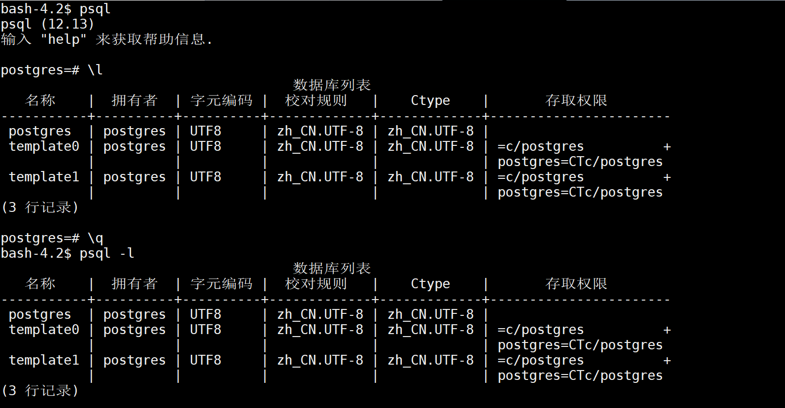

可以直接基于psql操作。

```
可以使用psql --help，查看psql的命令
可以直接进入到命令行的原因是psql默认情况下，就是以postgres用户去连接本地的pgsql，所以可以直接进入
下面的图是默认的连接方式
```

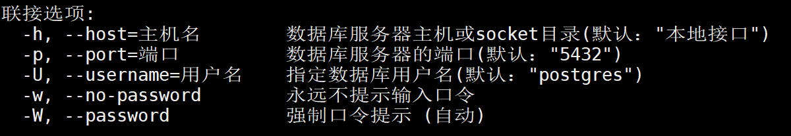

后面都基于psql的命令行（客户端）去进行操作

命令不用背，需要使用的时候，直接找帮助文档，在psql命令行中，直接输入如下命令：

```
\help，即可查看到数据库级别的一些命令
\?，可以查看到服务级别的一些命令
```

## 5.1 用户相关

构建用户命令：

```sql
# create user默认有连接权限，而create role没有，但可以基于选项设置
CREATE USER 名称 [ [ WITH ] 选项 [ ... ] ]
CREATE ROLE 名称 [ [ WITH ] 选项 [ ... ] ]
```

创建一个超级管理员用户：

```sql
CREATE USER root WITH SUPERUSER PASSWORD 'root';
```

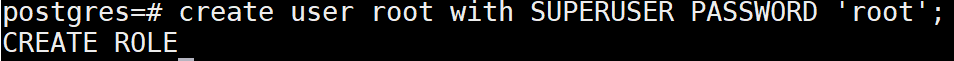

退出psql命令行


尝试去用root用户登录的psql命令：

```sh
psql -h 192.168.11.32 -p 5432 -U root -W
```

根据提示发现，光有用户不让登录，用户需要有一个数据库，创建一个root库：

```
create database root;
```


可以在不退出psql的前提下，直接切换数据库

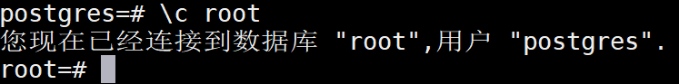

也可以退出psql，重新基于psql命令去切换用户以及数据库

如果要修改用户信息，或者删除用户，可以查看

```sh
# 修改用户，直接基于ALTER命令操作
# 删除用户，直接基于DROP命令操作
```

如果要查看现在的全部用户信息

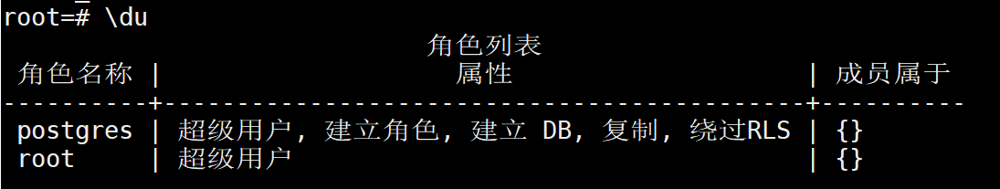

## 5.2 权限操作

权限操作前，要先掌握一下PGSQL的逻辑结构

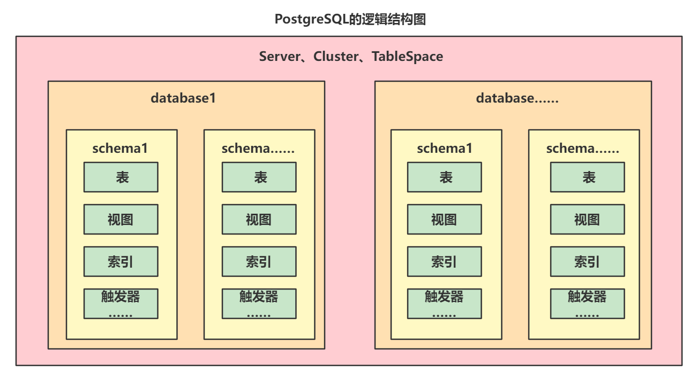

PostgreSQL一个数据库中有多个schema，在每个schema下都有自己的相应的表信息，权限粒度比MySQL更细一些。

在PostgreSQL中，权限的管理分为很多多层：

* server、cluster、tablespace级别：基于pg_hba.conf去配置；
* database级别：通过grant命令操作；
* namespace、schema级别：使用不多，暂不了解；
* 对象级别：通过grant命令去设置。

对database或者是对象级别做权限控制可以直接基于grant命令去操作，查看grant命令的使用帮助：

```sh
# 查看grant命令
\help grant
```

## 小任务

* 构建一个用户
* 构建一个数据库
* 在这个数据库下构建一个schema（数据库默认有一个public的schema）
* 将这个schema的权限赋予用户
* 在这个schema下构建一个表
* 将表的select，update，insert权限赋予用户

## 完成上述操作

```sql
-- 准备用户
create user user_oliver with password 'password';
-- 准备数据库
create database database_oliver;
-- 切换数据库
\c db_oliver;
-- 构建schema
create schema schema_oliver;
-- 将schema的拥有者修改为oliver用户
alter schema schema_oliver owner to user_oliver;
-- 将database_oliver库下的schema_oliver的schema中的表的增，改，查权限赋予给user_oliver用户
grant select,insert,update on all tables in schema schema_oliver to user_oliver;
-- 用postgres用户先构建一张表
create table schema_oliver.test(id int);
-- 切换到laozheng用户。
\c user_oliver -password 
-- 报错：
-- 致命错误:  对用户"-user_oliver"的对等认证失败
-- Previous connection kept
-- 上述方式直接凉凉，原因是匹配连接方式时，基于pg_hba.conf文件去从上往下找
-- 找到的第一个是local，匹配上的。发现连接方式是peer。
-- peer代表用当前系统用户去连接PostgreSQL
-- 当前系统用户只有postgres，没有user_oliver，无法使用peer连接
-- 想构建user_oliver用户时，发现PostgreSQL的所有文件拥有者和所属组都是postgres，并且能操作的只有拥有者
```

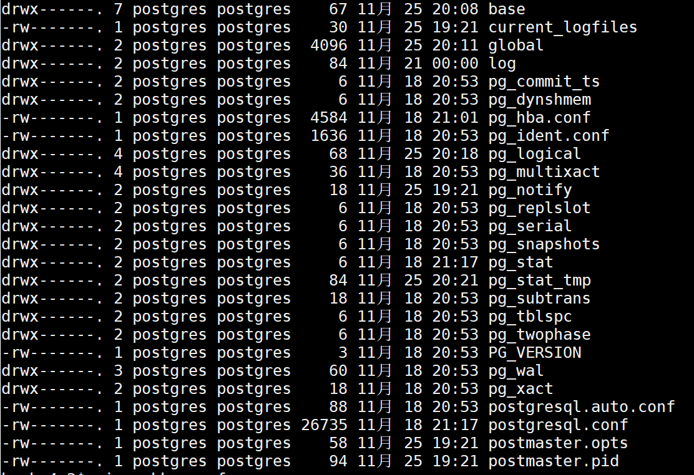

```
-- 基于上述问题，不采用本地连接即可。
-- 采用远程连接。
psql -h 127.0.0.1 -p 5432 -U user_oliver -W
-- 这样依赖，跳过了local链接方式的匹配，直接锁定到后面的host，host的连接方式是md5，md5其实就是密码加密了。
-- 登录后，直接输入
\dn
-- 查看到当前database下有两个schema
```

这种权限的赋予方式，可以用管理员用户去构建整体表结构，分配指定用户，赋予不同的权限，就不怕用户误操作了。

# 六、PostgreSQL图形化界面pgAdmin安装使用

图形化界面可以连接PostgreSQL的很多，Navicat（收费）。

也可以直接使用PostgreSQL官方提供的图形化界面（完全免费）。

pgAdmin官方地址：https://www.pgadmin.org/

Windows安装包下载地址：https://www.postgresql.org/ftp/pgadmin/pgadmin4/v6.9/windows/

下载后，一直下一步进行傻瓜式安装。

## 打开pgAdmin

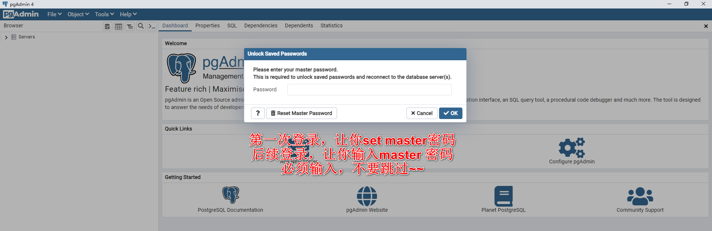

## 添加一个连接

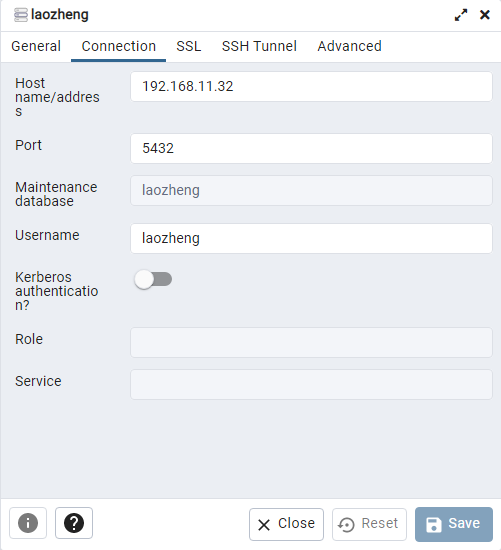

保存

## 查看数据库的信息

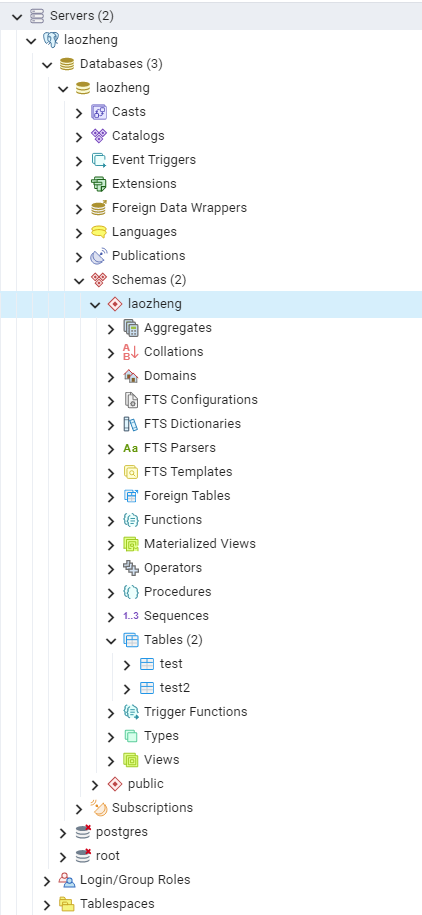

## 切换语言

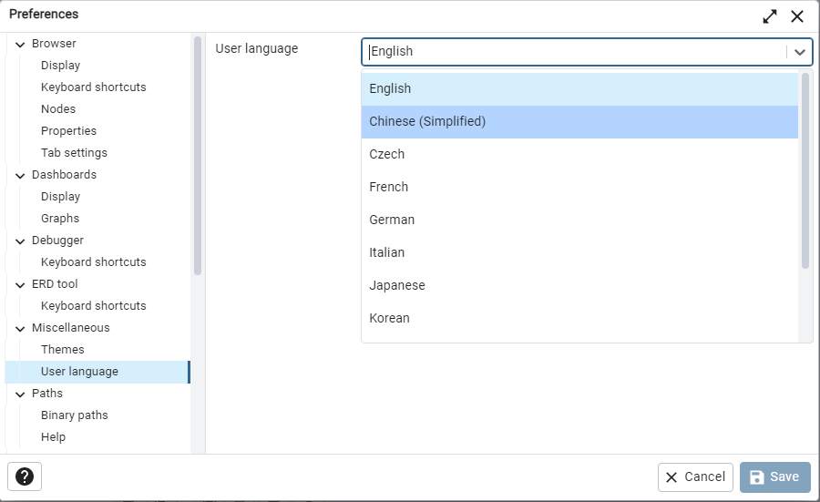

# 七、PostgreSQL数据类型

PostgreSQL支持的类型特别丰富，大多数的类型和MySQL都有对应的关系

| 名称       | 说明                                                                                 | 对比MySQL                                                             |
| ---------- |------------------------------------------------------------------------------------|---------------------------------------------------------------------|
| 布尔类型   | boolean，标准的布尔类型，只能存储true，false                                                     | MySQL中虽然没有对应的boolean，但是有替换的类型，数值的tinyint类型，和PostgreSQL的boolean都是占1个字节。 |
| 整型       | smallint（2字节），integer（4字节），bigint（8字节）                                             | 跟MySQL没啥区别。                                                         |
| 浮点型     | decimal，numeric（和decimal一样，精准浮点型），real（float），double precision（double），money（货币类型） | 和MySQL基本也没区别，MySQL支持float，double，decimal。MySQL没有这个货币类型。             |
| 字符串类型 | varchar(n)（character varying），char(n)（character），text                              | 这里和MySQL基本没区别。但PostgreSQL存储的varchar类型，可以存储一个G。MySQL最大存储65535b。      |
| 日期类型   | date（年月日），time（时分秒），timestamp（年月日时分秒）（time和timestamp可以设置时区）                        | 没啥说的，和MySQL基本没区别，但MySQL有个datetime。                                  |
| 二进制类型 | bytea-存储二进制类型                                                                      | MySQL也支持，MySQL中是blob                                                |
| 位图类型   | bit(n)（定长位图），bit varying(n)（可变长度位图）                                                | 就是存储0，1。MySQL也有，用的不多。                                           |
| 枚举类型   | enum，跟Java的enum一样                                                                  | MySQL支持。                                                            |
| 几何类型   | 点，直线，线段，圆等等                                                                        | MySQL不支持，一般开发不用。                                                    |
| 数组类型   | 在类型后，追加[]，代表存储数组                                                                   | MySQL不支持                                                            |
| JSON类型   | json（存储JSON数据的文本），jsonb（存储JSON二进制）                                                 | 可以存储JSON，MySQL8.x也支持                                                |
| ip类型     | cidr（存储ip地址）                                                                       | MySQL不支持                                                            |

其他类型：http://www.postgres.cn/docs/12/datatype.html

# 八、PostgreSQL基本操作和数据类型

## 8.1 单引号和双引号

在PostgreSQL中，写SQL语句时：

* 单引号用来标识实际的值；
* 双引号用来标识一个关键字，比如表名，字段名。

```sql
-- 单引号写具体的值，双引号类似MySQL的``标记，用来填充关键字
-- 下面的葡萄牙会报错，因为葡萄牙不是关键字
select 1.414,'卡塔尔',"葡萄牙";
```

## 8.2 数据类型转换

第一种方式：只需要在值的前面，添加上具体的数据类型即可

```sql
-- 将字符串转成位图类型
select bit '010101010101001';
```

第二种方式：也可以在具体值的后面，添加上 ::类型，来指定

```sql
-- 数据类型
select '2011-11-11'::date;
select '101010101001'::bit(20);
select '13'::int;
```

第三种方式：使用CAST函数

```sql
-- 类型转换的完整写法
select CAST(varchar '100' as int);
```

## 8.3 布尔类型

布尔类型可以存储三个值，true，false，null

```sql
-- 布尔类型的约束没有那么强，true，false大小写随意，他会给你转，同时yes，no这种他也认识，但是需要转换
select true,false,'yes'::boolean,boolean 'no',True,FaLse,NULL::boolean;
```

boolean类型在做and和or的逻辑操作时的结果：

| 字段A | 字段B | a and b | a or b |
| ----- | ----- | ------- | ------ |
| true  | true  | true    | true   |
| true  | false | false   | true   |
| true  | NULL  | NULL    | true   |
| false | false | false   | false  |
| false | NULL  | false   | NULL   |
| NULL  | NULL  | NULL    | NULL   |

## 8.4 数值类型

### 8.4.1 整型

整型比较简单，主要就是三个：

* smallint、int2：2字节
* integer、int、int4：4字节
* bigint、int8：8字节

使用策略如下：

* 正常就用integer；
* 如果要存主键，比如雪花算法，那就bigint；
* 要节约空间，就用smallint。

### 8.4.2 浮点型

浮点类型就关注两个（其实是一个）

* decimal(n,m)：本质就是numeric，PostgreSQL会帮转换；
* numeric(n,m)：PostgreSQL本质的浮点类型。

针对浮点类型的数据，使用numeric即可。

### 8.4.3 序列

MySQL中的主键自增，是基于auto_increment去实现，没有序列的对象。

PostgreSQL和Oracle十分相似，支持序列：sequence，没有auto_increment。

序列的正常构建方式：

```sql
create sequence schema_oliver.table_id_seq;
-- 查询下一个值
select nextval('schema_oliver.table_id_seq');
-- 查询当前值
select currval('schema_oliver.table_id_seq');
```

注意：

* 默认情况下，seqeunce的起始值是0，每次nextval递增1，最大值9223372036854775807；
* 告诉缓存，插入的数据比较多，可以指定告诉缓存，一次性计算出20个后续的值，nextval时，就不可以不去计算，直接去高速缓存拿值，效率会有一内内的提升；
* 序列大多数的应用，是用作表的主键自增效果。

```sql
-- 表自增
create table schema_oliver.xxx(
    id int8 default nextval('schema_oliver.table_id_seq'),
    name varchar(16)
);
insert into schema_oliver.xxx (name) values ('xxx');
select * from schema_oliver.xxx;
```

上面这种写法没有问题，但是很麻烦。

PostgreSQL提供了序列的数据类型，可以在声明表结构时，直接指定序列的类型即可。

bigserial相当于是bigint类型设置了序列实现自增。

类型对应如下：

* smallserial对应smallint；
* serial对应int；
* bigserial对应bigint。

```sql
-- 表自增
create table schema_oliver.yyy(
    id bigserial,   
    name varchar(16)
);
insert into schema_oliver.yyy (name) values ('yyy');
```

注意：

* 在drop表之后，序列不会被删除，但是序列会变为不可用的状态。 因为序列在使用serial去构建时，会绑定到指定表的指定列上。
* 如果是单独构建序列，再构建表，使用传统方式实现，序列和表就是相对独立的。

### 8.4.4 数值的常见操作

针对数值可以实现加减乘除取余这5个操作

还有其他的操作方式

| 操作符 | 描述   | 示例    | 结果 |
| ------ | ------ | ------- | ---- |
| ^      | 幂     | 2 ^ 3   | 8    |
| \|/    | 平方根 | \|/ 36  | 6    |
| @      | 绝对值 | @ -5    | 5    |
| &      | 与     | 31 & 16 | 16   |
| \|     | 或     | 31\|32  | 63   |
| <<     | 左移   | 1<<1    | 2    |
| >>     | 右移   | 16>>1   | 8    |

数值操作也提供了一些函数，比如pi()，round(数值, 位数)，floor()，ceil()

## 8.5 字符串类型

字符串类型用的是最多的一种，在PostgreSQL里，主要支持三种：

* character（就是MySQL的char类型），定长字符串。（最大可以存储1G）
* character varying（varchar），可变长度的字符串。（最大可以存储1G）
* text（跟MySQL一样）长度特别长的字符串。

注意： 字符串的拼接一要要使用\|\|来拼接。

其他的函数，可以查看：http://www.postgres.cn/docs/12/functions-string.html

## 8.6 日期类型

在PostgreSQL中，核心的时间类型，就三个。

* timestamp（时间戳，年月日时分秒）
* date（年月日）
* time（时分秒）

在PostgreSQL中，声明时间的方式。

只需要使用字符串正常的编写 yyyy-MM-dd HH:mm:ss 就可以转换为时间类型。

直接在字符串位置使用之前讲到的数据类型转换就可以了。

当前系统时间：

* 可以使用now作为当前系统时间（没有时区的概念）
  ```
  select timestamp 'now';
  -- 直接查询now，没有时区的概念
  select time with time zone 'now' at time zone '08:00:00'
  ```
* 也可以使用current_timestamp的方式获取（推荐，默认东八区）

日期类型的运算：

* 正常对date类型做+，-操作，默认单位是天
* date + time = timestamp~~~
  ```
  select date '2011-11-11' + time '12:12:12' ;
  ```
* 可以针对timestamp使用interval的方式进行 +,- 操作，在查询以时间范围为条件的内容时，可以使用
  ```
  select timestamp '2011-11-11 12:12:12' + interval '1day' + interval '1minute' + interval '1month';
  ```

## 8.7 枚举类型

枚举类型MySQL也支持，只是没使用，PostgreSQL同样支持这种数据类型

可以声明枚举类型作为表中的字段类型，这样可以无形的给表字段追加规范。

```sql
-- 声明一个星期的枚举，值自然只有周一~周日。
create type week as enum ('Mon','Tues','Sun');
-- 声明一张表，表中的某个字段的类型是上面声明的枚举。
drop table test;
create table test(
    id bigserial ,
    weekday week
);
insert into test (weekday) values ('Mon');
insert into test (weekday) values ('Fri');
```

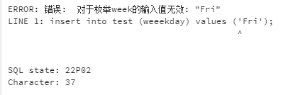

## 8.8 IP类型

PostgreSQL支持IP类型的存储，支持IPv4，IPv6，甚至MAC地址类型也支持。

IP类型，可以在存储IP时，帮助做校验，其次也可以针对IP做范围查找。

IP校验：

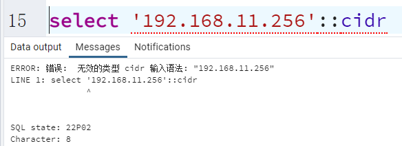

IP范围查找：

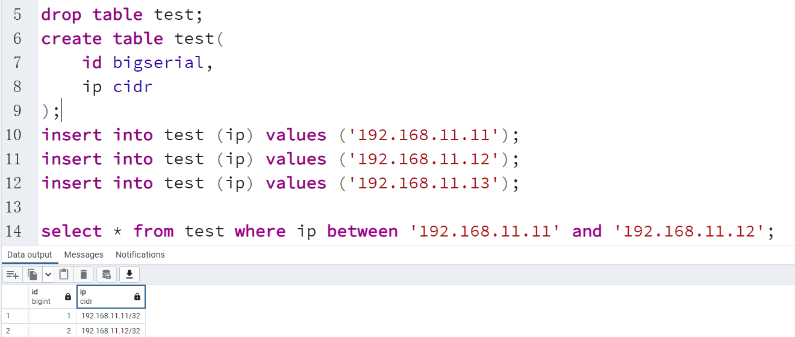

## 8.9 JSON&JSONB类型

JSON在MySQL8.x中也做了支持，但是MySQL支持的不好，因为JSON类型做查询时，基本无法给JSON字段做索引。

PostgreSQL支持JSON类型以及JSONB类型，JSON和JSONB的使用基本没区别。

抛开JSON类型，本质上JSON格式就是一个字符串，比如MySQL5.7不支持JSON的情况的下，使用text也可以，但是字符串类型无法校验JSON的格式，单独的字符串也没有办法只获取JSON中某个key对应的value。

JSON和JSONB的区别：

* JSON类型无法构建索引，JSONB类型可以创建索引；
* JSON类型的数据中多余的空格会被存储下来，JSONB会自动取消多余的空格；
* JSON类型甚至可以存储重复的key，JSONB不会保留多余的重复key（只保留最后一个）；
* JSON会保留存储时key的顺序，JSONB不会保留原有顺序。

JSON中key对应的value的数据类型

| JSON    | PostgreSQL    |
| ------- |---------------|
| String  | text          |
| number  | numeric       |
| boolean | boolean       |
| null    | (none)        |

```json
[
  {"name": "张三"},
  {"name": {
      "info": "xxx"
    }}

]
```

操作JSON：

* 上述的四种JSON存储的类型：
  ```
  select '9'::JSON,'null'::JSON,'"oliver"'::JSON,'true'::json;
  select '9'::JSONB,'null'::JSONB,'"oliver"'::JSONB,'true'::JSONB;
  ```
* JSON数组
  ```
  select '[9,true,null,"我是字符串"]'::JSON;
  ```

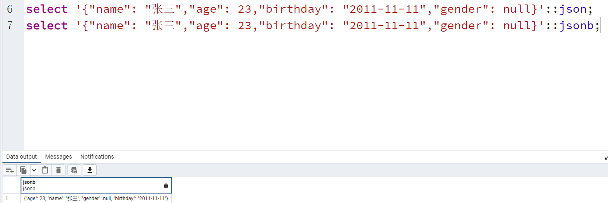

* JSON对象
  ```
  select '{"name": "张三","age": 23,"birthday": "2011-11-11","gender": null}'::json;
  select '{"name": "张三","age": 23,"birthday": "2011-11-11","gender": null}'::jsonb;
  ```
* 构建表存储JSON
  ```
  create table test(
      id bigserial,
      info json,
      infob jsonb
  );
  insert into
    test
  (info,infob)   
    values 
  ('{"name":            "张三"              ,"age": 23,"birthday": "2011-11-11","gender": null}',
  '{"name":               "张三"             ,"age": 23,"birthday": "2011-11-11","gender": null}')
  select * from test;
  ```

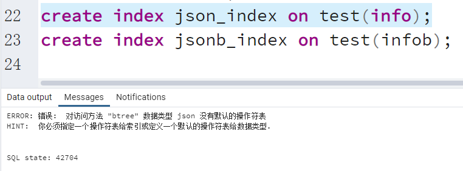

* 构建索引的效果
  ```
  create index json_index on test(info);
  create index jsonb_index on test(infob);
  ```

JSON还支持很多函数，可以在文档中查询：http://www.postgres.cn/docs/12/functions-json.html

## 8.10 复合类型

复合类型就好像Java中的一个对象，Java中有一个User，User和表做了一个映射，User中有个人信息对象，基于符合类型映射个人信息。

```Java
public class User {
   private Integer id;
   private Info info;
}

class Info {
   private String name;
   private Integer age;
}
```

按照上面的情况，将Info构建成一个复合类型

```sql
-- 构建复合类型，映射上Info
create type type_info as (name varchar(32),age int);
-- 构建表，映射User
create table tb_user(
    id serial,
    info type_info
);
-- 添加数据
insert into tb_user (info) values (('张三',23));
insert into tb_user (info) values (('露丝',233));
insert into tb_user (info) values (('jack',33));
insert into tb_user (info) values (('李四',24));
select * from tb_user;
```

## 8.11 数组类型

数组还是要依赖其他类型，比如在设置住址，住址可能有多个住址，可以采用数组类型去修饰字符串。

PostgreSQL中，指定数组的方式就是[]，可以指定一维数组，也支持二维甚至更多维数组。

构建数组的方式：

```sql
drop table test;
create table test(
    id serial,
    col1 int[],
    col2 int[2],
    col3 int[][]
);
-- 构建表指定数组长度后，并不是说数组内容只有2的长度，可以插入更多数据
-- 甚至在插入数据，如果将二维数组结构的数组扔到一维数组上，也可以存储。
-- 数组编写方式
select '{{how,are},{are,you}}'::varchar[];
select array[[1,2],[3,4]];
insert into test (col1,col2,col3) values ('{1,2,3}','{4,5,6}','{7,8,9}');
insert into test (col1,col2,col3) values ('{1,2,3}','{4,5,6}',array[[1,2],[3,4]]);
insert into test (col1,col2,col3) values ('{1,2,3}','{4,5,6}','{{1,2},{3,4}}');
select * from test;
```

其他特殊情况？

* 如果要存储字符串数组？
* 如果存储的数组中有双引号怎么办？
* 如果有大括号怎么办？

```sql
-- 如果存储的数组中的值，有单引号怎么办？
-- 使用两个单引号，作为一个单引号使用
select '{''how''}'::varchar[];
-- 如果存储的数组中的值，有逗号怎么办？(PGSQL中的数组索引从1开始算，写0也是从1开始算。)
-- 用双引号将数组的数据包起来~
select ('{"how,are"}'::varchar[])[2];
-- 如果存储的数组中的值，有双引号怎么办？
-- 如果要添加双引号，记得转义。
select ('{"\"how\",are"}'::varchar[])[1];
```

数组的比较方式

```sql
-- 包含
select array[1,2] @> array[1];
-- 被包含
select array[1,2] <@ array[1,2,4];
-- 是否有相同元素
select array[2,4,4,45,1] && array[1];
```
